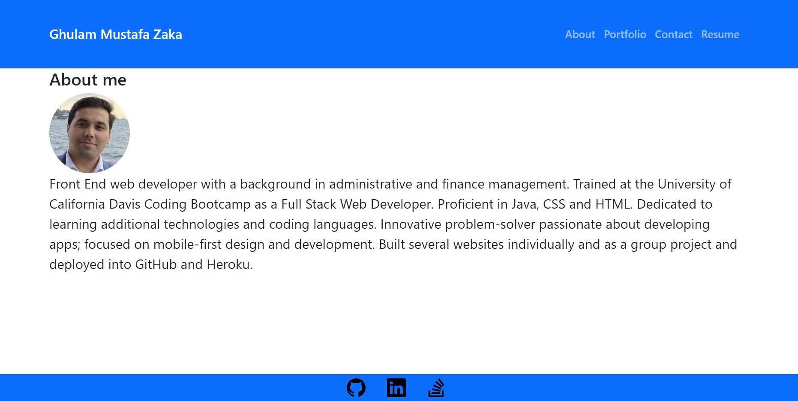
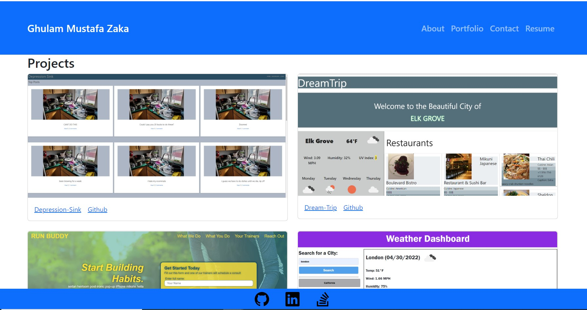
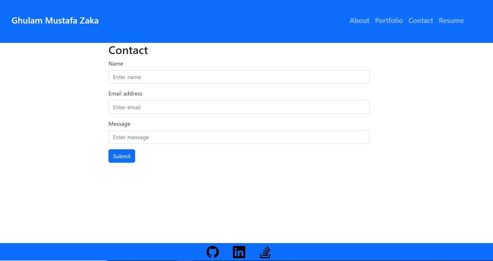
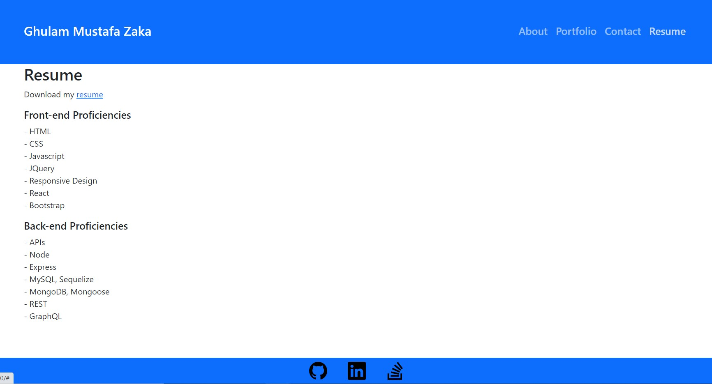

# My-Portfolio-React

## Description

This is a single-page application portfolio which built using React library. It has different sections which describes more about the projects which I build individually and as group. Every project has links to its github respositories and deployed version. A contact form has been provided to reach out me. In resume section, list of my skills on technologies on the front and backend is provided. In addition, a link to my resume is also provided if the users wants to download it.

## Deployed URL

## Github URL

https://github.com/GhulamZaka/my-portfolio-react

## Screenshot

